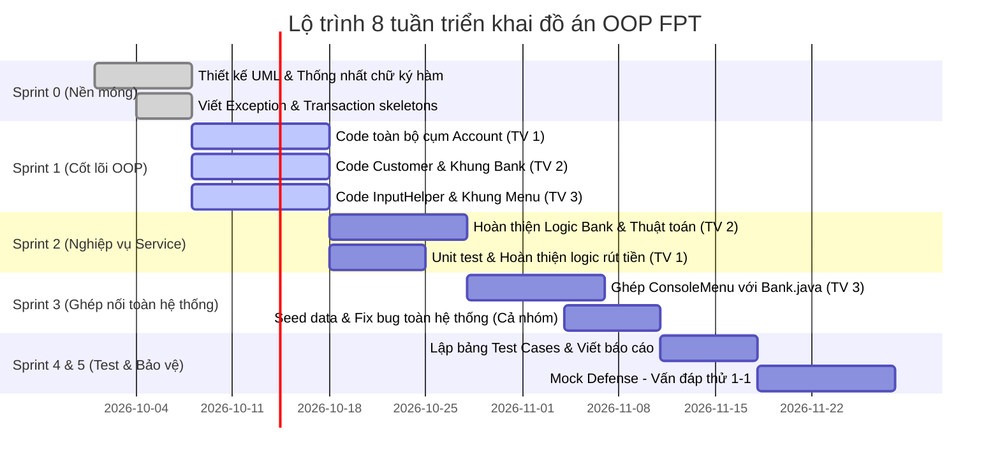

# KẾ HOẠCH PHÂN CHIA NHIỆM VỤ & LỘ TRÌNH TRIỂN KHAI DỰ ÁN
## Giải pháp chống "Giẫm chân nhau" & Đạt điểm tối đa phản biện Code Review

---

## 1. Nguyên Tắc Cốt Lõi Để Không "Giẫm Chân Nhau" (No Dependency Deadlock)

Nguyên nhân lớn nhất khiến các nhóm sinh viên làm bài tập lớn bị xung đột code hoặc phải ngồi chờ nhau là **code tự do không có "Hợp đồng giao tiếp" (Interface/Method Signature)**.

Nhóm chúng ta sẽ áp dụng 3 nguyên tắc của môi trường làm việc chuyên nghiệp:

1. **Contract-First (Thống nhất chữ ký hàm trước):** Trước khi viết logic bên trong, các class phải thống nhất tên hàm, kiểu dữ liệu truyền vào và kiểu trả về (ví dụ: `withdraw(double amount) throws InsufficientFundsException, InvalidAmountException`). Khi đã có chữ ký hàm trống, các thành viên có thể gọi hàm của nhau mà không bị báo lỗi biên dịch (red code).
2. **Tách biệt tuyệt đối Tầng Giao Diện (UI) và Tầng Nghiệp Vụ (Service):**
   - File giao diện (`ConsoleMenu.java`) **chỉ làm 3 việc:** Hiển thị menu, nhận Scanner từ người dùng, và gọi hàm của `Bank.java` ra rồi in kết quả.
   - Tuyệt đối **không viết code tính toán hay logic ngân hàng trong file UI**.
3. **Quy trình Git phân nhánh rõ ràng (Branching Strategy):**
   - Nhánh `main`: Chỉ chứa code đã test chạy ổn định, không ai được commit trực tiếp vào `main`.
   - Mỗi thành viên làm việc trên nhánh riêng: `feature/models-account`, `feature/bank-service`, `feature/ui-exceptions`.
   - Ghép code thông qua Pull Request (PR) sau khi các thành viên còn lại đã review.

---

## 2. Bảng Phân Chia Công Việc Chi Tiết Cho 3 Thành Viên

```
                            ┌──────────────────────────────────────────────┐
                            │               Kiến trúc hệ thống             │
                            └──────────────────────┬───────────────────────┘
                                                   │
          ┌────────────────────────────────────────┼────────────────────────────────────────┐
          ▼                                        ▼                                        ▼
┌──────────────────┐                     ┌──────────────────┐                     ┌──────────────────┐
│   Thành viên 1   │                     │   Thành viên 2   │                     │   Thành viên 3   │
│  (Domain Model)  │                     │  (Bank Service)  │                     │  (UI & Exception)│
├──────────────────┤                     ├──────────────────┤                     ├──────────────────┤
│• Account (abs)   │                     │• Customer        │                     │• Custom Excs     │
│• SavingsAccount  │                     │• Transaction     │                     │• InputHelper     │
│• CheckingAccount │                     │• TransactionType │                     │• ConsoleMenu     │
│• FixedDepositAcc │                     │• Bank (Service)  │                     │• Main            │
└──────────────────┘                     └──────────────────┘                     └──────────────────┘
```

### 👤 THÀNH VIÊN 1: Chuyên Gia Lõi Thực Thể (Domain Core & OOP Specialist)
* **Các file phụ trách:**
  - `src/bank/model/Account.java` (abstract class)
  - `src/bank/model/SavingsAccount.java`
  - `src/bank/model/CheckingAccount.java`
  - `src/bank/model/FixedDepositAccount.java`
* **Nhiệm vụ & Chức năng đề bài:**
  - **F3:** Rút tiền với quy tắc riêng biệt cho từng loại tài khoản (nòng cốt thể hiện tính Đa hình runtime).
  - **F7:** Phương thức trừ phí / tính lãi hàng tháng (`applyMonthlyInterestOrFee()`).
  - Thiết kế Constructor chaining (`super(...)`), tính đóng gói (`private`, `getter/setter`), và ghi đè `toString()`.
* **Trọng tâm kiến thức khi phản biện giảng viên:**
  - *"Tại sao `Account` phải là `abstract` mà không phải `interface` hay class thông thường?"*
  - *"Tính đa hình (Polymorphism) thể hiện ở đâu khi gọi `withdraw()`?"*
  - *"Tại sao các thuộc tính như `balance`, `accountNumber` nên để `protected` hay `private`?"*

---

### 👤 THÀNH VIÊN 2: Chuyên Gia Nghiệp Vụ & Dữ Liệu (Business Logic & Collections Specialist)
* **Các file phụ trách:**
  - `src/bank/model/Customer.java`
  - `src/bank/model/Transaction.java`
  - `src/bank/model/TransactionType.java` (Enum)
  - `src/bank/service/Bank.java` (Trung tâm điều phối nghiệp vụ)
* **Nhiệm vụ & Chức năng đề bài:**
  - **F1:** Mở tài khoản mới và liên kết với Customer.
  - **F2:** Logic nạp tiền vào tài khoản thông qua Bank.
  - **F4:** **Logic Chuyển tiền (Transfer)** đảm bảo tính toàn vẹn (trừ nguồn $\rightarrow$ cộng đích $\rightarrow$ ghi nhận 2 giao dịch).
  - **F5:** Liệt kê danh sách tài khoản theo từng khách hàng.
  - **F6:** Xem lịch sử giao dịch.
  - **Thuật toán chuyên sâu:** Sắp xếp tài khoản theo số dư (dùng `Comparator`), tìm kiếm tài khoản theo số tài khoản hoặc CCCD.
  - **Quản lý dữ liệu:** Sử dụng `HashMap<String, Account>`, `HashMap<String, Customer>`.
* **Trọng tâm kiến thức khi phản biện giảng viên:**
  - *"Tại sao lại chọn `HashMap` thay vì `ArrayList` để quản lý tài khoản trong `Bank`? Độ phức tạp khi tìm kiếm là bao nhiêu ($O(1)$ hay $O(n)$)?"*
  - *"Nếu giao dịch chuyển tiền bị lỗi ở bước cộng tiền cho người nhận thì hệ thống xử lý thế nào để không bị mất tiền của người gửi?"*
  - *"Trình bày thuật toán sắp xếp tài khoản theo số dư (`Comparator` vs `Comparable`)?"*

---

### 👤 THÀNH VIÊN 3: Chuyên Gia Giao Diện & Ngoại Lệ (UI/UX & Exception Handling Specialist)
* **Các file phụ trách:**
  - `src/bank/exception/BankException.java` (Lớp cha)
  - `src/bank/exception/InsufficientFundsException.java`
  - `src/bank/exception/InvalidAmountException.java`
  - `src/bank/exception/AccountNotFoundException.java`
  - `src/bank/ui/InputHelper.java` (Tiện ích validate console)
  - `src/bank/ui/ConsoleMenu.java` (Vòng lặp menu và kết nối)
  - `src/bank/Main.java` (Điểm khởi chạy ứng dụng)
* **Nhiệm vụ & Chức năng đề bài:**
  - **F8:** Thiết kế hệ thống ngoại lệ phân cấp và xử lý `try-catch` toàn diện.
  - Xây dựng `InputHelper`: Bộ công cụ bắt lỗi nhập liệu cực mạnh (chống crash khi người dùng nhập chuỗi vào ô nhập số, nhập ngày tháng sai định dạng, nhập chuỗi rỗng).
  - Thiết kế `ConsoleMenu`: Giao diện dòng lệnh chuyên nghiệp, hiển thị bảng biểu, format tiền tệ đẹp mắt.
  - Khởi tạo dữ liệu mẫu (Seeding demo data) trong `Main.java` để sẵn sàng demo cho giảng viên mà không cần ngồi nhập từng tài khoản bằng tay.
* **Trọng tâm kiến thức khi phản biện giảng viên:**
  - *"Phân biệt Checked Exception và Unchecked Exception trong Java? Bộ Exception em viết thuộc loại nào?"*
  - *"Từ khóa `throw` và `throws` khác nhau như thế nào?"*
  - *"Tại sao không dùng `System.out.println()` để báo lỗi trong các hàm tính toán mà bắt buộc phải ném (`throw`) Exception?"*

---

## 3. Lộ Trình 5 Sprint Trong 8 Tuần (Không Nghẽn Việc)



### Chi tiết các Sprint:
* **Sprint 0 (Tuần 1):** 
  - TV 3 code xong 4 file Exception (rất ngắn, mỗi file chỉ 5-10 dòng gọi `super(message)`).
  - TV 2 code xong `Transaction.java` và `TransactionType.java`.
  - Cả nhóm commit lên GitHub $\rightarrow$ Tất cả kéo về máy. Lúc này dự án đã có sẵn các class cơ bản, **không ai bị thiếu dependency nữa**.
* **Sprint 1 (Tuần 2 - 3):**
  - TV 1 viết toàn bộ logic của `Account` và 3 class con. Vì đã có `Transaction` và `Exception` từ Sprint 0 nên TV 1 thoải mái viết mà không bị lỗi biên dịch.
  - TV 2 viết `Customer.java` và tạo khung class `Bank.java`.
  - TV 3 viết `InputHelper.java` (các hàm như `getInt()`, `getDouble()`, `getString()`).
* **Sprint 2 (Tuần 4 - 5):**
  - TV 2 triển khai toàn bộ các nghiệp vụ F1, F2, F4, F5, F6, F7 trong `Bank.java`.
  - TV 1 hỗ trợ TV 2 kiểm thử tính đúng đắn của logic tính lãi và rút tiền.
* **Sprint 3 (Tuần 6):**
  - TV 3 kết nối `ConsoleMenu.java` gọi vào các phương thức của `Bank.java`.
  - Cả 3 người cùng chạy thử toàn bộ luồng, thử cố tình nhập sai dữ liệu để kiểm tra xem có chỗ nào bị văng app không.
* **Sprint 4 & 5 (Tuần 7 - 8):**
  - Lập bảng ma trận Test Case cho 8 chức năng.
  - Cả 3 thành viên đổi vị trí: Mỗi người đọc và giải thích code của 2 người còn lại để chuẩn bị cho buổi vấn đáp trực tiếp với giảng viên.
